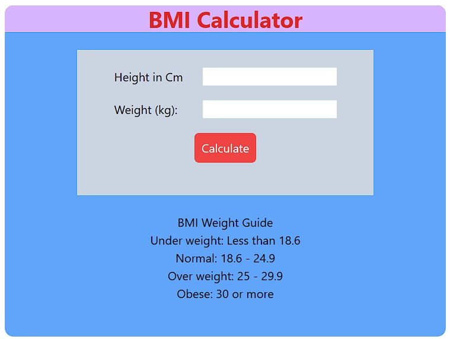
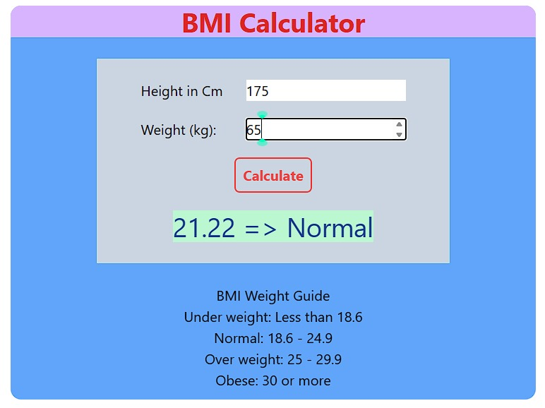

# JavaScripts Projects

## Project 1 js Code Solution: Background color changer

```javascript
const bgBox = document.querySelector(".box")
const btn = document.querySelectorAll(".btn")

btn.forEach(e => {

    e.addEventListener("click", ev => {
        if (ev.target.id === "gray") {
            bgBox.style.backgroundColor = ev.target.id
        }
        else if (ev.target.id === "yellow") {
            bgBox.style.backgroundColor = ev.target.id
        }
        else if (ev.target.id === "purple") {
            bgBox.style.backgroundColor = ev.target.id
        }
        else if (ev.target.id === "pink") {
            bgBox.style.backgroundColor = ev.target.id
        }
    })
});

const box = document.querySelector(".box")
const body = document.querySelector("body")

body.addEventListener("click", () => {
    box.style.backgroundColor = "orange";
});

box.addEventListener("click", ev => {
    ev.stopPropagation();
});

```

## Project 2 BMI Calculator

```javascript
const form = document.querySelector("form")
form.addEventListener("submit", e=>{
    e.preventDefault()

    const height = parseFloat(document.querySelector("#height").value)
    const weight = parseFloat(document.querySelector("#weight").value)

    let formula = (weight/(height**2))*10000
    
    let result = formula.toFixed(2)

    if (result<18.6){
        document.querySelector("#result").innerHTML = `${result} => UnderWeight`
    }
    else if (result>=18.6 && result<24.9){
        document.querySelector("#result").innerHTML = `${result} => Normal`
    }
    else if (result>=25 && result<29.9){
        document.querySelector("#result").innerHTML = `${result} => Overweight`
    }
    else{
        document.querySelector("#result").innerHTML = `${result} => Obese`
    }

    // document.querySelector("#result").innerHTML = `<b>${result}</b>`;


})
```



## Project 3 Digital Clock

```javascript
const clock = document.querySelector("#clock")
setInterval(function (e){
    let date = new Date()
    clock.innerHTML = date.toLocaleTimeString();
},1000)
```

## Project 4 Number Guessing Game

```javascript
let randomNumber = parseInt(Math.random()*100 + 1)

const submit = document.querySelector("#subt")
let userInput = document.querySelector("#guessField")
const prevGuesses = document.querySelector(".guesses")
const remainingGuess = document.querySelector(".lastResult")
const highOrLow = document.querySelector(".lowOrHi")
const startOver = document.querySelector(".resultParas")
const p = document.createElement("p")

let userGuessArr = []
let guessCount = 1

let playGame = true

if(playGame){
    submit.addEventListener("click", function(e){
        e.preventDefault()
        let userGuess = parseInt(userInput.value);
        console.log(userGuess);
        validateGuess(userGuess);
    })
}

function validateGuess(guess){
    if(isNaN(guess)){
        alert("Enter a valid number.");
    }else if(guess < 1 || guess > 100){
        alert("Enter a number between 1 and 100.");
    }else {
        userGuessArr.push(guess);
        if(guessCount > 10){
            displayGuess(guess)
            displayMessage(`Game over!! Random number was ${randomNumber}`)
            endGame()
        }else{
            displayGuess(guess)
            checkGuess(guess)
        }
    }
}

function checkGuess(guess){
    if(guess === randomNumber){
        displayMessage("you win!! You guessed it right")
        endGame()

    }else if(guess < randomNumber){
        displayMessage("Your guess is too low!!")

    }else if(guess > randomNumber){
        displayMessage("Your guess is too high!!")
    }
}

function displayGuess(guess){
    userInput.value = ""
    prevGuesses.innerHTML += `${guess} , ` 
    guessCount++
    remainingGuess.innerHTML = `${11-guessCount}`
}

function displayMessage(message){
    highOrLow.innerHTML = `<h3>${message}</h3>`
}

function endGame(){
    userInput.value = ""
    userInput.setAttribute("disabled","")
    p.classList.add("button")
    p.innerHTML = `<h2 class="cursor-pointer text-2xl mt-6 text-white bg-black p-2" id="newGame">Start New Game</h2>`
    startOver.appendChild(p)
    playGame = false
    newGame()
}

function newGame(){
    const newGameButton = document.querySelector("#newGame")
    newGameButton.addEventListener("click", function(e){
        userInput.removeAttribute("disabled")
        randomNumber = parseInt(Math.random()*100 + 1)
        guessCount = 1
        remainingGuess.innerHTML = `${11-guessCount}`
        highOrLow.innerHTML = `<h3>Start guessing</h3>`
        userGuessArr = []
        prevGuesses.innerHTML = ""
        startOver.removeChild(p)
        playGame = true
    })

}
```